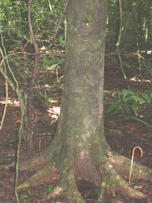
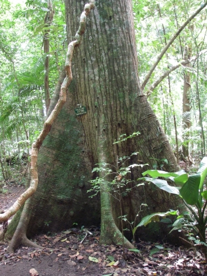

```{r setup, include = F}
knitr::opts_chunk$set(warning = F, message = F)
```

### 0. Set up and accessing the data ###

First we need to install some R packages. The _remotes_ packages allows you to easily download packages that are on GitHub, like the _BIOMASS_ package and the _allodb_ package that we will discuss later. We will use the _rdryad_ package to access forest data that is stored in Dryad (an online data repository). 

```{r}
#install.packages("remotes",repos = "http://cran.us.r-project.org")
#install.packages("rdryad",repos = "http://cran.us.r-project.org")
#remotes::install_github("ropensci/allodb")
#remotes::install_github('umr-amap/BIOMASS')

library(rdryad)
library(allodb)

```

For these examples, we will use the census data from the Barro Colorado Island (BCI) ForestGEO plot. The data is open access and can be downloaded from an online repository (Condit et al., 2019). BCI has 8 full censuses, though we will only be working with the last 2 censuses (#7 & #8) today. 

The following code will download the data, unpackage it, and collect the two most recent censuses. We will also load a table containing species data for all species present in BCI and connect it with the census data in the dataframe `stems_spp`.

```{r}
#this code section is adapted from Appendix S1 of Pipiniot & Muller-Landau (in press).
dryad_data_path <- rdryad::dryad_download("10.15146/5xcp-0d46")

#unzip files
zip_files <- grep("\\.zip", dryad_data_path$`10.15146/5xcp-0d46`, value = TRUE)
zip_folders <- sapply(zip_files, function(dir) {
  name <- gsub("\\.zip", "", data.table::last(strsplit(dir, '/')[[1]]))
  utils::unzip(dir, exdir = name)
})

bci_stem <- list.files("bci.stem")[c(7,8)] #select last two censuses

census_list <- lapply(bci_stem, function(name) { #load census data from the unzipped folders
  load(paste0("bci.stem/", name)); get(strsplit(name, "\\.rda")[[1]][1])
})

load(grep("spp", dryad_data_path$`10.15146/5xcp-0d46`, value = TRUE)) #load the species table
census_7 <- merge(cbind(census_list[[1]],CensusID = 7), bci.spptable, by = "sp", all.x = T) #bind species table to census #7
census_8 <- merge(cbind(census_list[[2]],CensusID = 8), bci.spptable, by = "sp", all.x = T) #bind species table to census #8 
stems_spp <- rbind(census_7, census_8) #combine censuses into a single dataframe

```

### 1. Calculate biomass for a single tree ###

First, we need to select only a single tree from our census. Here, we chose a _Trichilia tuberculata_.
<center>

{width=12%,height=10%}

</center>

We will use the most recent diameter measurement for this tree along with an allometry to estimate the biomass.
The most widely used allometry for tropical forests is the pantropical allometric equation from Chave _et al._ 2014:

$$AGB = (0.0673 * (\rho * H * D^2)^.976) / 1000$$
Here, above-ground biomass (AGB) is calculated as a function of tree diameter (D, in cm), tree height (H, in m), and wood density ($\rho$, in g cm$^-3$). Diameter, or dbh, is included in our dataset, $\rho$ is species-level trait that is also included in our data (column "wsg"). Height is not included in our data, so we will use a height of 25 m to start with. We then divide by 1000 so that our biomass units will be in Mg. 


```{r}
single_tree <- subset(stems_spp,treeID == 4137 & CensusID == 8)
#dbh
print(single_tree$dbh)
D <- 350/10 #convert dbh in mm to cm
#H
H <- 25
#wood density
print(single_tree$wsg)
rho <- .6275

AGB <- (0.0673 * (rho * H * D^2)^.976)/ 1000
print(AGB)
```

Using this equation, we estimate the biomass of this tree is `r round(AGB,3)` Mg.


##### ***Challenge #1:*** **Without copying the above code, can you calculate the biomass of a different tree in the BCI census?** #####


We have a problem - the height value we assigned this tree was a guess, not a field measurement. What if the tree is a different height?


```{r}

many_H <- 1:45
AGB_height <- (0.0673 * (rho * many_H * D^2)^.976)/ 1000

plot(x = many_H, y = AGB_height, main = "Effect of height on calculation of ABG", xlab = "Height (m)", ylab = "Above-ground Biomass (kg)") 
points(x = H, y = AGB, pch = 21, bg = "red", cex = 2)
legend(1.5, 1.8, legend = c("H = 25 m"),pch = c(21),col = "black",pt.cex = 2,pt.bg = c("red"), bg = "grey90")

```

We see that height is very important. There are multiple ways that height is measured in the field AND there are different choices for how to estimate height if field measurements aren't available. Here we will use an allometric equation developed specifically for the BCI plot that estimates height from dbh (Martínez Cano et al. 2019):

$$H = \frac{58.0D^.73}{21.8 + D^.73}$$


```{r}
D <- 350/10 #Use the same diameter from our tree

H <- (58.0 * (D^.73))/(21.8 + (D^.73)) #Calculate height using the BCI allometry

print(H) #The new height is 22.08 m

AGB_correctH <- (0.0673 * (rho * H * D^2)^.976)/ 1000

print(AGB_correctH) #The new biomass is .904 Mg

plot(x = many_H, y = AGB_height, main = "Effect of height on calculation of ABG: Part II", xlab = "Height (m)", ylab = "Above-ground Biomass (kg)") 
points(x = c(H,25), y = c(AGB_correctH,AGB), pch = 21, bg = c("darkred","red"), cex = 2)
arrows(x0 = 25, y0 = AGB, x1 = H, y1 = AGB_correctH,length = .1,lwd = 3,col = "red")
legend(1.5, 1.8, legend = c("H = 25 m","H from allometry"),pch = c(21),col = "black",pt.cex = 2,pt.bg = c("red","darkred"), bg = "grey90")

```

Using the new calculation for height, we see a substantially different estimate of AGB: `r round(AGB_correctH,3)` Mg instead of `r round(AGB,3)` Mg (11% less)!

### 2. Biomass stocks & fluxes for the whole forest plot ###

#### Biomass stock ####
Now that we've calculated biomass for one tree, we will move onto the whole plot. All we need to do is expand our code to run on every tree in the most recent census.

```{r}

All_Ds <-   census_8$dbh/10 #Get all of the diameters from census
All_rhos <- census_8$wsg #Get all wood densities from census
All_H <- (58.0 * (All_Ds^.73))/(21.8 + (All_Ds^.73)) #Calculate height for all trees in the census

All_AGB_census8 <- (0.0673 * (All_rhos * All_H * All_Ds^2)^.976) / 1000

Total_Biomass_BCI <- sum(All_AGB_census8,na.rm=T) / 50 #calculate Mg Ha-1 of biomass by dividing over the 50 hectares of the plot


```

We estimate the biomass stock of BCI in the 2015 census to be  **`r round(Total_Biomass_BCI,2)`** $Mg$ $Ha^-1$. 

##### ***Challenge #2:*** **Without copying the provided code, can you calcuate the biomass stock for the BCI plot in the previous census (census #7)?** #####


#### Net change in biomass ####


```{r}
stems_spp$dbh_cm <- stems_spp$dbh / 10
stems_spp$Height <- (58.0 * (stems_spp$dbh_cm^.73))/(21.8 + (stems_spp$dbh_cm^.73))
stems_spp$AGB <- (0.0673 * (stems_spp$wsg * stems_spp$Height * stems_spp$dbh_cm^2)^.976) / 1000

AGB_stocks <- tapply(stems_spp$AGB,stems_spp$CensusID,sum,na.rm=T)

AGB_netchange <- (AGB_stocks[2] - AGB_stocks[1]) / 50 / 5 #Calculate Mg Ha-1 Yr-1: normalize by area and 5-year census interval.

print(unname(AGB_netchange))
```

##### ***Challenge #3:*** **Net change in aboveground biomass is made up of multiple component fluxes (broadly: woody growth, mortality, and recruitment). How would calculate these seperate fluxes? Try to calculate the mortality flux. ** #####

## Isn't there a package for that?##

There is. There are many packages that to help with allometries, biomass calculations,etc. We will briefly demonstrate two packages developed by ForestGEO members and collaborators, one for us in the tropics and one for extratropical forests.

### BIOMASS ###

For tropical forests, we can use the _biomass_ package (Réjou-Méchain *et al.* 2017) to apply the Chave *et al.* 2014 pantropical allometry just like we did earlier. 

```{r}
library(BIOMASS)
D <- 35
rho  <- .6275
H <- 22.08
BIOMASS_agb <- computeAGB(D = D,WD = rho,H = H) #ABG in Mg of biomass
print(BIOMASS_agb)
```

We get the same answer (phew!). The *BIOMASS* package also offers a number of other useful features. It has helpful functions to clean up typos in taxonomic names *correctTaxo()*, lookup wood density values for your species *getWoodDensity()*, and propogate errors for better tracking of uncertainty *AGBmonteCarlo()*. 

Additionally, it has implemented alternative equations for estimating tree height if you do not have field measurements or your own site allometries. One of the options uses another equation from Chave *et al.* 2014: instead of tree height, you can provide coordinates of your site and the package will use environmental conditions to create a new allometric equation and calculate height for your data.

```{r}
#coordinates of BCI plot from ForestGEO website
lat <- 9.1543
lon <- -79.8461

coordAllom_agb <- computeAGB(D = D,WD = rho,coord = c(lon, lat) ) #ABG in Mg of biomass
print(coordAllom_agb)
```
Notice that we get a different value with this method because it using a different allometry.

### allodb ###

For the extratropics, the _allodb_ package (Gonzalez-Akre *et al.* 2022) is a new package that brings together 570 different allometric equations, including the commonly-used Jenkins and Chojnacky equations. It creates new allometries based on the location and species in your dataset, by applying a weighting scheme to all applicable allometries in it's database. Unlike the pantropical allometry, these are frequently species or genus specific so you need to provide taxonomic data (beyond wood density)

```{r}
library(allodb)
#here we use new (fake) tree attributes since this package focuses on the extratropics
D <- 50
Genus <- "Liriodendron"
Species <- "tulipifera"
latlong <- c(-78.1454, 38.8935)

allodb_AGB <- get_biomass(dbh = D, genus = Genus, species = Species, coords = latlong)

print(allodb_AGB)

```
## Mapping our results ##

Frequently, we are interested in not just a single calculation for a whole plot, but to see how biomass stocks and fluxes vary within a ForestGEO plot. 


```{r}

```


## But wait there's more... ##

While we have covered the foundation of how to make biomass calculations from forest inventory data, there are many details that may complicate your methods (read: will *definitely* complicate your methods).

For example: in the BCI plot (and other tropical forest sites) large root buttresses can interfere with measurements of diameter at the standard height (1.3 meters). Therefore allometries based on dbh taken at the standard height must be corrected via tapering equations (Cushman *et al.* 2014). 

<center>

{width=12%,height=10%}

</center>


